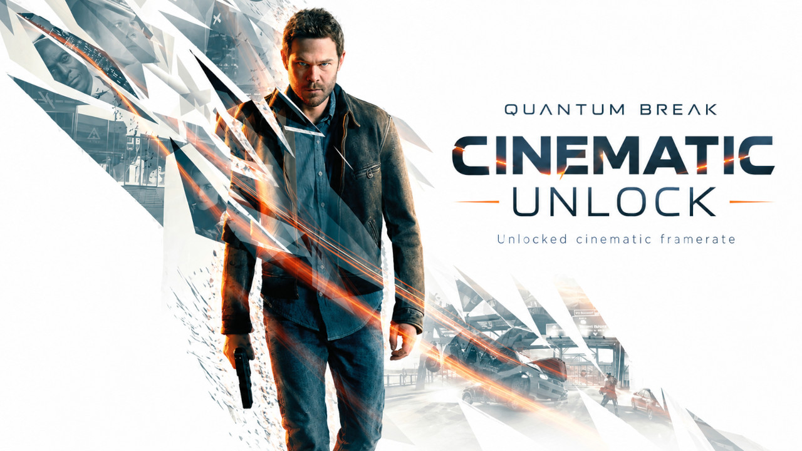

# Quantum Break Cinematic Unlock



An ASI plugin for **Quantum Break — Steam, Windows x64** that removes the 30 FPS cap from in-engine cinematics, allowing them to play at your game's native framerate while preserving playback timing and audio.

## Installation

1. Install an x64 ASI loader separately. [Ultimate ASI Loader](https://github.com/ThirteenAG/Ultimate-ASI-Loader/releases) is one supported option. Do not overwrite an existing loader or graphics proxy.
2. Copy `QuantumBreakCinematicUnlock.asi` to `QuantumBreak/dx11`, beside `QuantumBreak.exe`.
3. Start the game through Steam.

The plugin writes `QuantumBreakCinematicUnlock.log` beside itself as soon as the DLL is loaded:

```text
[QuantumBreakCinematicUnlock] ... | ASI plugin loaded. | asi=... | exe=...
[QuantumBreakCinematicUnlock] ... | ASI initialize entered.
[QuantumBreakCinematicUnlock] ... | ASI plugin is active.
```

`asi=` and `exe=` are the files the process actually loaded. If the game folder refuses the file, the same lines are written to `%TEMP%\QuantumBreakCinematicUnlock.log`, and the first line is the Windows error from the folder beside the plugin. If neither file can be created, the game shows one dialog with both error codes.

- A log beside the `.asi` means the plugin ran. The lines show how far startup got.
- No log beside the `.asi`, but one in `%TEMP%`, means the plugin ran and could not write next to itself.
- No log in either place, and no dialog, means the process never executed the plugin. The ASI loader does not record loads. It also stays silent when the `.asi` is outside the folders it scans, or when the file is the wrong 32/64-bit build. Put `QuantumBreakCinematicUnlock.asi` and the x64 loader DLL in `QuantumBreak/dx11`, beside `QuantumBreak.exe`. That loader also scans `scripts` and `plugins` next to itself, and does not scan the parent `QuantumBreak` folder. A dialog titled "ASI Loader" that says "Unable to load" means the file was found but Windows rejected it.

An `ERROR` line from activation means it was refused and no patch was committed. To remove the mod, close the game and delete the `.asi`. The game executable is never changed.

## How it works

Quantum Break uses a forced playback mode for its in-engine camera cinematics, which is responsible for limiting them to 30 FPS.

Two build-specific conditional branches renew that forced mode while camera events are present. This plugin changes only those branches from `JZ` (`0x74`) to `JMP` (`0xEB`), preventing the game from re-applying the forced cinematic mode.

This removes the 30 FPS restriction without changing the cinematic timeline clock, frame duration, or audio settings.

That alone is not enough. A camera focus curve may be cleaned up and then applied again during the same interpolation pass, leaving depth of field active after the scene. The plugin hooks the common curve callback and the timeline stop routine:

- During an active or paused camera timeline, it defers a pending focus-curve cleanup only while the current frame is inside that curve's own bounds.
- Once the timeline stops, it lets the engine run the original cleanup for remaining pending camera focus curves and blocks a stopped timeline from applying them again.

The rule follows the curve and timeline state. There is no per-scene configuration, fixed delay, `Sleep` hook, or arbitrary reset of camera blur values.

Before it writes anything, the plugin verifies the exact supported Steam executable, checks all expected instructions, suspends the other game threads, applies the four changes together, verifies them, and resumes the threads. Any failed check leaves the patches inactive.

## Background

This project was made as an experiment with **Codex and Astra**. I am a simple developer with no prior knowledge of modding, decompilation, memory analysis, pseudocode, or assembly. I ran the experiments, described what I saw, and validated the game behavior; Codex and Astra helped investigate the engine, write the plugin, and build the tests.

The investigation used **x64dbg** to inspect memory dumps and **Ghidra** to inspect decompiled routines and x64 instructions, **Python with ctypes** for memory observations and reversible experiments, **PowerShell** for local workflows, and **MSVC x64** to compile the plugin. The final behavior was checked in game across two complete cinematics and a cinematic skip: smooth playback, synchronized audio, and no residual depth of field afterward.

## Build and tests

The complete ASI plugin source is in [`src/native`](src/native). With Visual Studio's x64 C++ tools installed, run:

```bat
scripts\build.cmd
scripts\test.cmd
```

The compiled plugin is written to `build/QuantumBreakCinematicUnlock.asi`. The tests cover the depth-of-field policy, engine adapter, x64 relay and unwind data, and atomic patch installation with rollback.

[MIT license](LICENSE). Independent community project; not affiliated with Remedy, Microsoft, OpenAI, or the ASI loader project. No game files or loader binaries are included.
